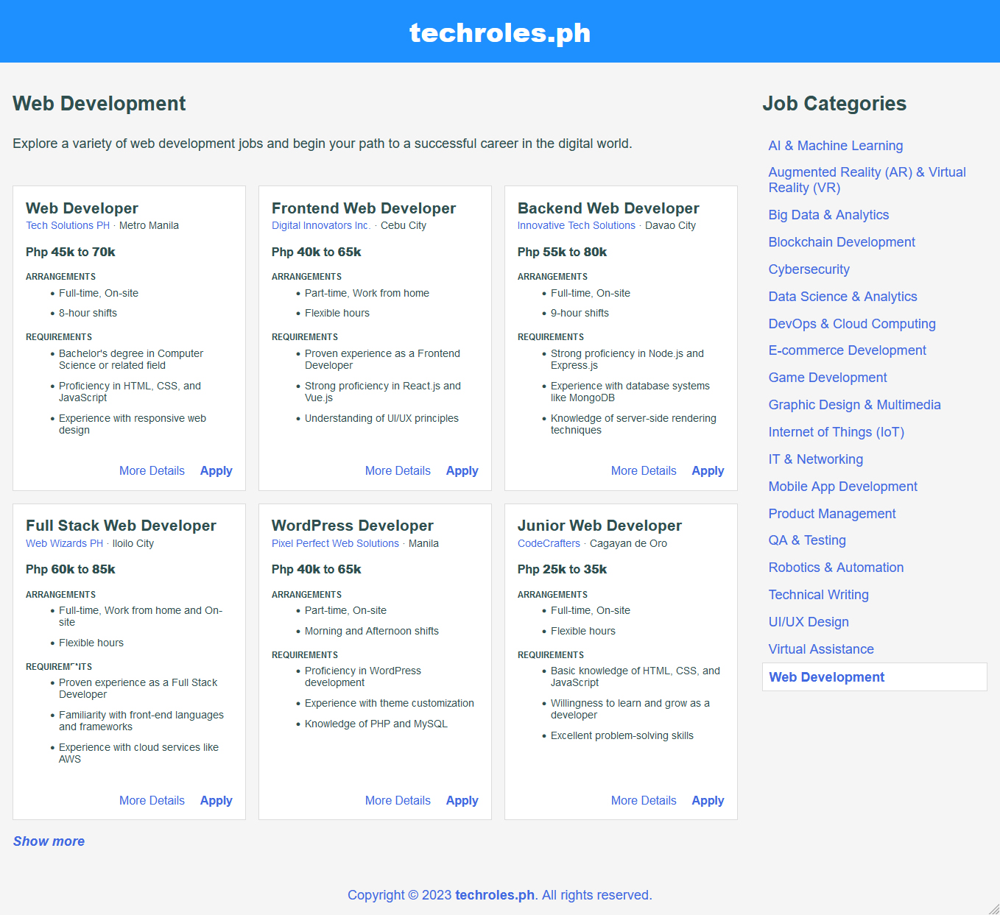
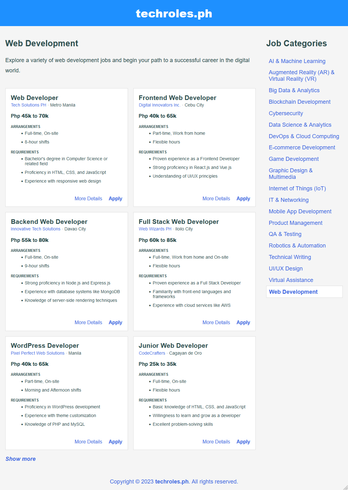
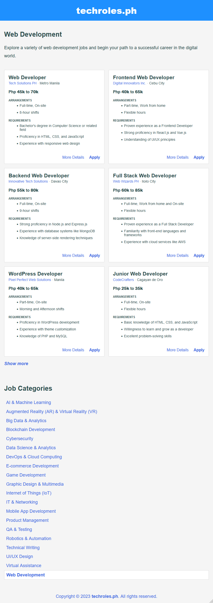

## CSS | Activity #3: Responsive Grid Layout
Create a responsive website called **techroles.ph**.

### Development Setup
The initial HTML and CSS files are already inside the [**src**](src) folder,
but there is one missing CSS file: `_layout.css`.
This file controls the grid layout styles.
Your task is to create `_layout.css` inside [**src/css**](src/css) folder
and integrate it into all HTML files.
It's recommended that you start by working with [**index.html**](src/index.html) first.

### Responsive Design
Below are the full images for each screen width breakpoint
in the responsive design that you need to achieve.

#### 1200px *(993px and above)*

#### 992px *(769px to 992px)*

#### 768px *(577px to 768px)*

#### 576px *(576px and below)*

